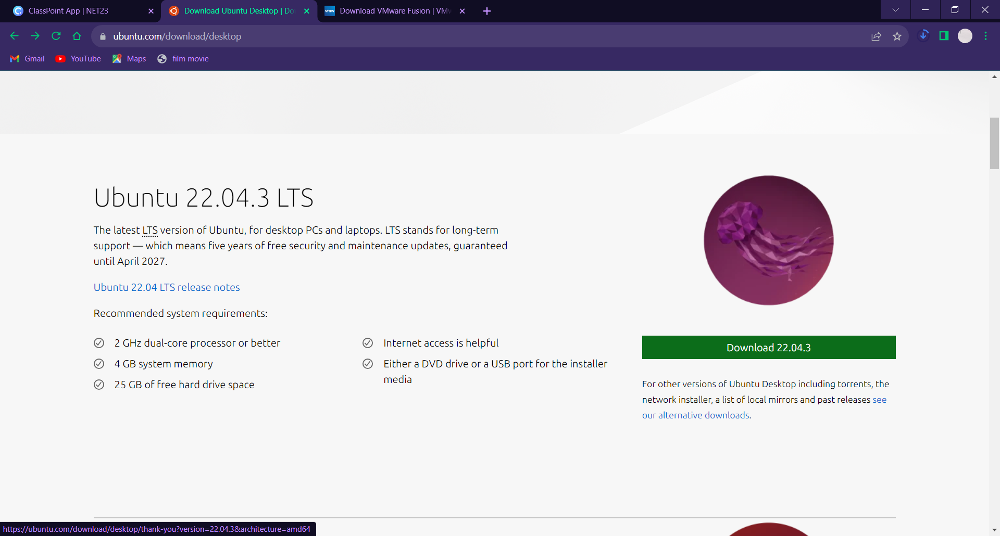
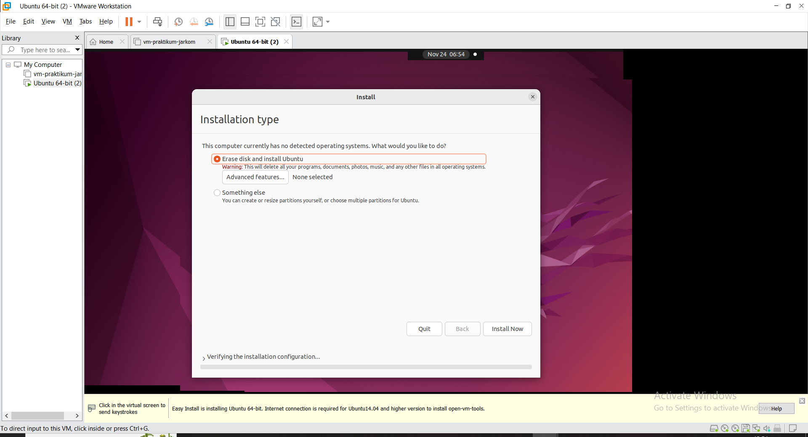

<div align=center>

# Linux Installation

</div>

## Table of Contents

1. [Instalasi Linux](#instalasi-linux)
2. [Virtual Machine](#a-virtual-machine)
    - [VMware](#vmware)
    - [VirtualBox](#virtualbox)
3. [WSL](#b-wsl-windows-subsystem-linux)

## Instalasi Linux

Linux dapat diinstall dengan beberapa cara diantaranya:
- Virtual Machine
- WSL (Windows Subsystem Linux)
- OS bawaan Harware
- Dual Boot

**Dalam pelatihan ini kami hanya memaparkan Virtual Machine dan WSL**

### a. Virtual Machine

#### VMware 

1. Masuk ke link berikut: https://www.vmware.com/products/workstation-pro/workstation-pro-evaluation.html

2. Lalu klik bagian download for windows: 

<div align=center>
    
</div>

3. Tunggu proses download hingga selesai

4. Lakukan proses instalasi sesuai dengan petunjuk

## Download Ubuntu ISO

1. Kunjungi website ubuntu berikut: https://ubuntu.com/download/desktop

2. Klik download untuk Ubuntu versi 22.04.3 (Jammy)

<div align=center>
    
</div>

3. Tunggu proses download hingga selesai

## Instalasi Ubuntu

1. Buka aplikasi virtual machine dan pilih create new vm


2. Pilih **Typical**
3. Untuk Guest Operating System, pilih installer disc image file (ISO), klik browse

4. Pada personalization, masukkan:
- full name:  ubuntu
- username: ubuntu
- password: root
- confirm: root

5. Masukkan storage dengan ukuran 25GB, dan store as a single file


6. Klik Finish

7. Buka VM Ubuntu yang telah kita buat, lalu tunggu hingga booting selesai

8. Lalu pilih bahasa inggris


9. Lalu pilih normal installation

10. Klik Install now dan continue


11. Masukkan ubuntu sebagai your name dan username, lalu masukkan root sebagai password

12. Tunggu proses instalasi hingga selesai

13. Kalau sudah klik restart now, lalu login dengan kredensial:
- username: ubuntu
- password: root

#### VirtualBox

## Download Ubuntu ISO

1. Kunjungi website ubuntu berikut: <a>https://ubuntu.com/download/desktop</a>

2. Klik download untuk Ubuntu versi 22.04.3 (Jammy)

## Install VirtualBox

1. Kunjungi Website VirtualBox berikut: <a>https://www.virtualbox.org/wiki/Downloads</a>

2. Download VirtualBox untuk Windows dan ikuti panduan instalasinya

## Instalasi Ubuntu

1. Buka VitualBox dan pilih **New**, beri nama VM, folder VM, dan sesuaikan ISO Image dengan ISO yang sudah didownload sebelumnya


2. Buat user profile baru untuk Ubuntu


3. Tentukan Resource untuk VM `bebas sesuai kebutuhan aja, tergantung laptop kalian gacor atau ngga :)`


4. Klik Finish dan Start VM


---

### b. WSL (Windows Subsystem Linux)

Windows Subsystem for Linux (WSL) adalah fitur Windows yang memungkinkan kita untuk menjalankan lingkungan Linux pada OS Windows, tanpa VM terpisah atau dual boot. WSL dirancang untuk memberikan pengalaman yang mulus dan produktif bagi developer yang ingin menggunakan Windows dan Linux secara bersamaan. WSL memungkinkan kita untuk menggunakan terminal Linux. Kelemahan dari WSL adalah instalasi App yang memerlukan GUI sedikit sulit untuk dilakukan dan masih banyak fitur Linux lain yang belum diadaptasi ke WSL.

## Instalasi WSL

1. Buka terminal sebagai Administrator dengan klik kanan pada terminal dan `Run as Administrator`


2. Untuk mengaktifkan WSL masukkan command
```sh
dism.exe /online /enable-feature /featurename:Microsoft-Windows-Subsystem-Linux /all /norestart
```

3. Untuk mengaktifkan Virtual Machine Platform masukkan command 
```sh
dism.exe /online /enable-feature /featurename:VirtualMachinePlatform /all /norestart
```

4. Restart Perangkat

5. Buat WSL2 sebagai default dengan command 
```sh
wsl --set-default-version 2
```

6. Sebelum menginstall distribusi WSL, kita bisa melihat distribusi yang tersedia dengan 
```sh
wsl -l -o
```

7. Pada terminal powershell, install Distribusi WSL, kali ini kita akan menggunakan Ubuntu 22.04 dengan command 
```sh 
wsl --install -d Ubuntu-22.04
```

8. Masukkan username dan password untuk WSL kalian

9. Buka WSL dengan terminal atau search bar

## [Next](../3%20-%20Linux%20Commands/README.md)