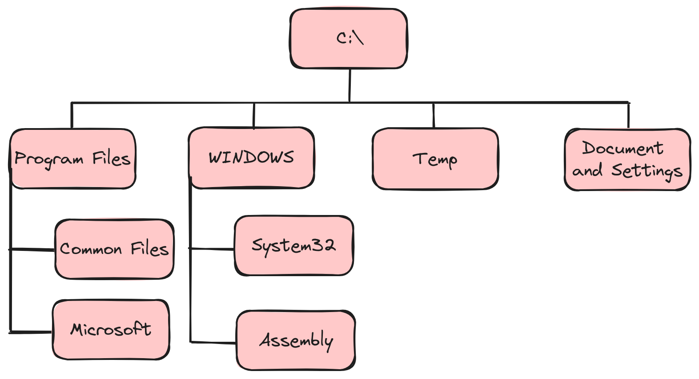
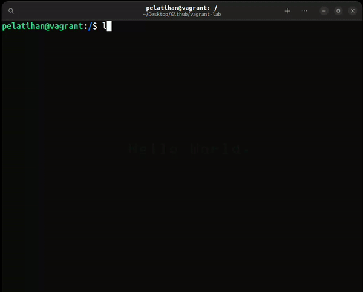
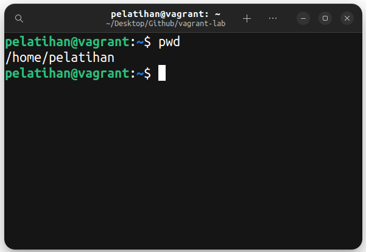
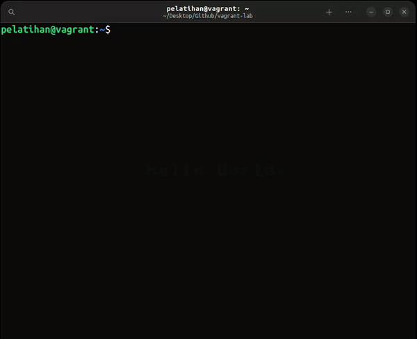
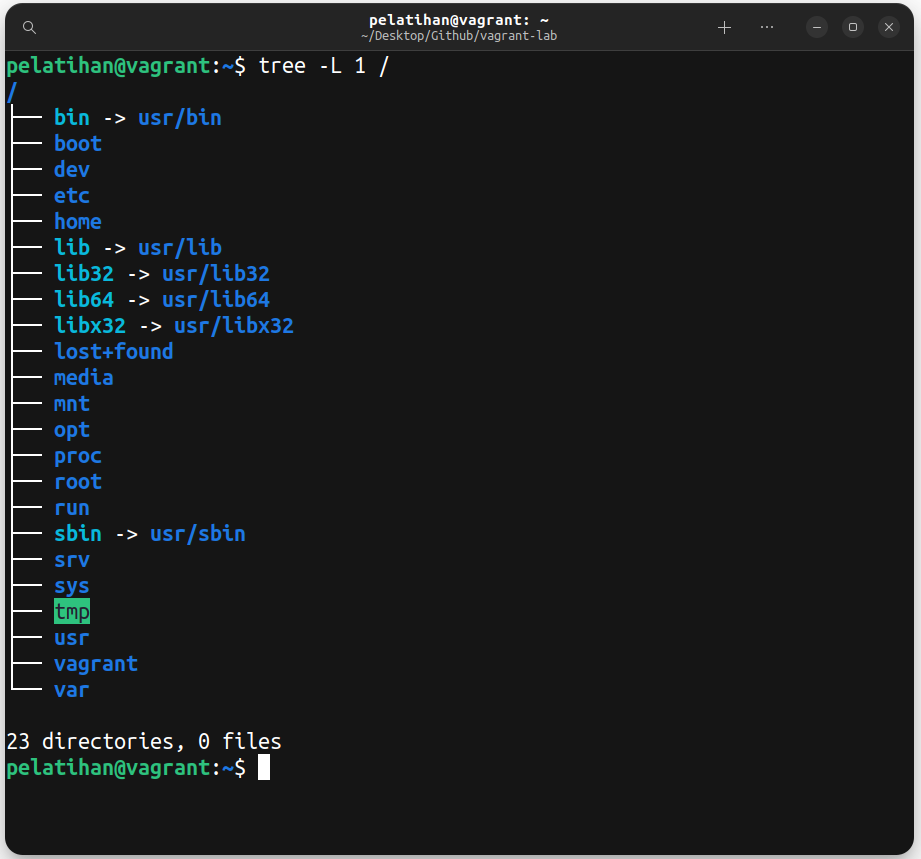
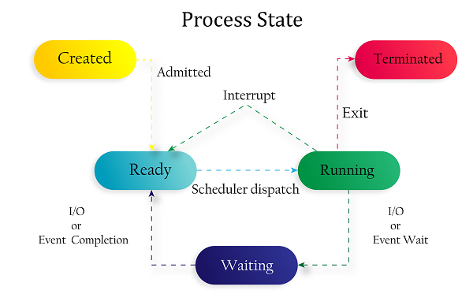
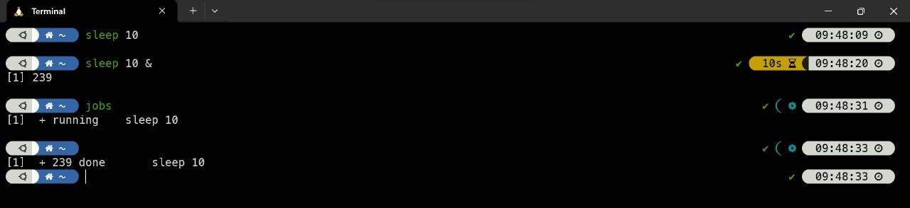
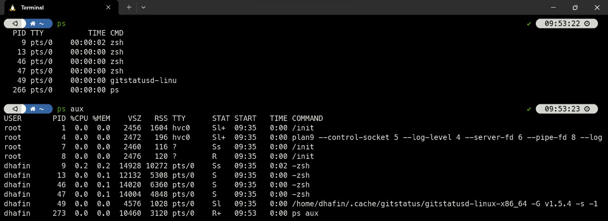
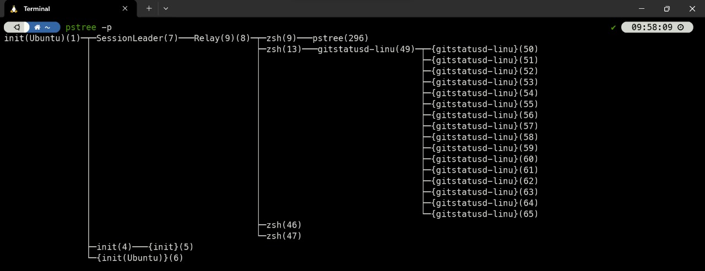
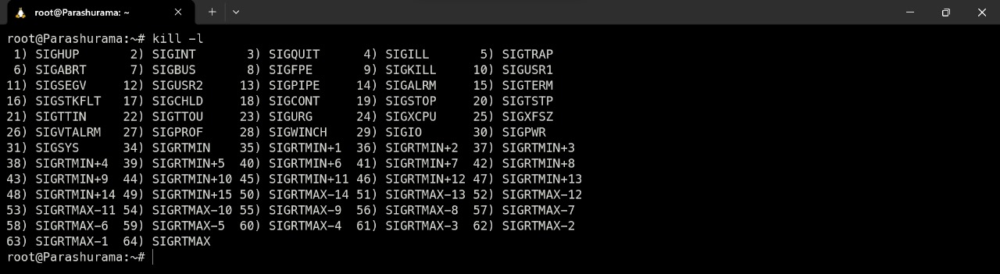

<div align=center>

# Linux Commands & Concept

</div>

## Table of Contents

1. [Command pada Linux](#command-pada-linux)
2. [Konsep User dan Permission pada Linux](#konsep-user-dan-permission-di-linux)
    - [User](#user)
    - [Permission](#permission)
    - [Pengaturan User dan Permission](#pengaturan-user-dan-permission)
3. [Struktur Direktori pada Linux](#struktur-direktori-pada-linux)
4. [Konsep Process pada Linux](#konsep-process-pada-linux)

## Command pada Linux

Pada Linux, terdapat beberapa perintah (command) dan juga navigasi yang umum digunakan sebagai berikut.

**Command Navigasi File dan Direktori:**

| Command      | Deskripsi |
| ----------- | ----------- |
| cd | untuk masuk ke direktori |
| ls | untuk melihat direktori |
| ll | untuk melihat direktori dengan detail |
| pwd | untuk melihat direktori aktif |
| find `<nama file>` | untuk mencari file |
| locate | untuk mencari file |

**Command Operasi File (Hapus, Buat, Edit File):**

| Command | Deskripsi |
| ----------- | ----------- |
| cp `<asal> <tujuan>` | untuk menyalin file |
| mv `<asal> <tujuan>` | untuk memindahkan folder |
| rm `<file>` | untuk menghapus file |
| mkdir `<nama folder>` | untuk membuat folder |
| cat | untuk melihat isi file |
| echo | untuk menampilkan baris teks |
| sed | untuk melakukan filter teks |
| awk | untuk memindahkan teks |

**Command Untuk User dan Permission:**

| Command      | Deskripsi |
| ----------- | ----------- |
| sudo | untuk super user |
| su | untuk mengganti user id |
| passwd | untuk mengganti password |
| who | untuk menampilkan user |
| chmod | untuk mengganti hak akses |
| chown | mengganti hak milik |
| chgrp | untuk mengganti hak grup |

**Command Advance Lain:**

| Command      | Deskripsi |
| ----------- | ----------- |
| history | untuk melihat riwayat |
| grep | untuk mencari kata |
| sort | untuk mengurutkan |
| ps | untuk menampilkan snapshot |
| kill | untuk menghentikan program |
| tar | untuk mengumpulkan file |
| zip | untuk mengkompres file |
| unzip | untuk mengekstrak file |
| ssh | untuk akses jarak jauh |
| fdisk | untuk menampilkan partisi |
| mount | untuk melampirkan file |
| umount | untuk melakukan unmount |
| du | untuk menampilkan ukuran file |
| df | untuk menampilkan disk space |
| quota | menampilkan sisa disk space |
| jobs `<id program>` | menampilkan identitas proses |
| ifconfig | untuk melihat ip |
| date | untuk menampilkan tanggal |
| top | melihat proses secara urut |
| clear | membersihkan terminal |
| dpkg -i `<namapackage>.deb` | instalasi paket |
| uname | melihat versi kernel |

## Konsep *User* dan *Permission* di Linux

Di Linux, konsep user dan permission sangat penting untuk keamanan sistem dan untuk memungkinkan pengguna untuk mengakses dan memanipulasi berbagai file dan direktori pada sistem.

### User

Di Linux, setiap aksi dijalankan oleh pengguna tertentu. Setiap pengguna diberikan sebuah username dan ID pengguna (UID) yang unik. Pengguna dapat memiliki password, dan mereka dapat dikonfigurasi untuk memiliki hak akses tertentu terhadap file dan direktori di sistem.

Ketika pengguna masuk ke sistem, mereka harus memasukkan nama pengguna dan kata sandi mereka untuk mengautentikasi diri mereka. Setelah pengguna berhasil masuk, mereka akan masuk ke sesi shell atau antarmuka grafis yang sesuai dengan hak akses yang telah ditentukan untuk akun pengguna tersebut.

### Permission

Setiap file dan direktori di Linux memiliki tiga jenis izin: read (baca), write (tulis), dan execute (jalankan). Izin ini dapat dikonfigurasi untuk setiap pengguna dan grup pengguna yang ada di sistem.

Ketika suatu aksi dilakukan pada file atau direktori, sistem operasi akan mengecek izin pengguna dan grup pengguna yang terkait dengan file atau direktori tersebut. Jika pengguna atau grup pengguna tidak memiliki izin yang sesuai, maka sistem akan menolak aksi tersebut.

Beberapa contoh tindakan yang memerlukan izin adalah:

- Read: membaca isi file atau direktori
- Write: menulis atau membuat perubahan pada file atau direktori
- Execute: menjalankan atau memulai sebuah file atau direktori

Izin juga dapat diberikan pada level sistem, seperti pada kernel atau modul, dan dapat dikonfigurasi menggunakan perintah-perintah tertentu di terminal.

Dalam Linux, administrator sistem (atau root) memiliki hak akses penuh ke semua file dan direktori di sistem. Ini memungkinkan administrator untuk mengelola pengguna dan grup pengguna, serta mengkonfigurasi hak akses untuk setiap file dan direktori di sistem.

### Pengaturan User dan Permission

**1. chmod**

`chmod` adalah singkatan dari "change mode" dan merupakan perintah di Linux yang digunakan untuk mengubah izin (permission) file atau direktori. Perintah ini memungkinkan pengguna untuk menetapkan hak akses untuk owner (pemilik file), group, dan other (pengguna lain) pada file atau direktori.

Format dari perintah chmod adalah sebagai berikut:

``` bash
chmod [mode] [file/directory]
```

Di mana mode merupakan kombinasi dari tiga digit yang mewakili izin baca, tulis, dan eksekusi. Digit pertama mewakili izin untuk owner, digit kedua untuk group, dan digit ketiga untuk other.

Untuk memberikan hak akses pada file atau direktori, Anda dapat menambahkan digit 4, 2, dan/atau 1 pada mode, masing-masing mewakili izin read (baca), write (tulis), dan execute (jalankan). Contohnya, chmod 755 file.txt akan memberikan hak baca, tulis, dan eksekusi untuk owner dan read serta execute untuk group dan other.

#### 2. chown

`chown` adalah perintah di Linux yang digunakan untuk mengubah pemilik (owner) file atau direktori. Ketika Anda ingin mengubah hak akses file atau direktori, Anda harus mengetahui siapa pemiliknya, sehingga perintah chown sangat penting.

Format dari perintah chown adalah sebagai berikut:

``` bash
chown [owner]:[group] [file/directory]
```

Di mana owner adalah username pemilik yang baru dan group adalah grup pemilik yang baru. Jika Anda tidak ingin mengubah grup pemilik, cukup abaikan bagian ini. Contohnya, chown john:staff file.txt akan mengubah pemilik file.txt menjadi john dan grup pemiliknya menjadi staff.

#### 3. su dan sudo

su (singkatan dari "switch user") dan sudo (singkatan dari "superuser do") adalah perintah Linux yang digunakan untuk beralih ke user lain dengan hak akses tertentu.

Perintah su digunakan untuk beralih ke user lain dengan hak akses root. Ketika perintah ini dijalankan, pengguna akan diminta memasukkan password root. Setelah berhasil memasukkan password, pengguna akan beralih ke user root.

Perintah sudo digunakan untuk menjalankan perintah sebagai superuser (root) dengan hak akses tertentu. Pengguna harus memasukkan password mereka sendiri (bukan password root) untuk menjalankan perintah ini. Contohnya, sudo apt-get update akan menjalankan perintah apt-get update dengan hak akses root.

## Struktur Direktori pada Linux

Jika kita ingin belajar Linux lebih mendalam, hal yang paling dasar untuk dipahami adalah struktur direktorinya. Struktur direktori pada Linux sangat berbeda dengan Windows. Berikut adalah perbandingan sturuktur direktori baik Windows maupun Linux.

### Struktur direktori Windows



| **Directory** | **Deskripsi**|
|---------------|--------------|
|Program Files  |Berfungsi untuk menyimpan program-program dan aplikasi yang terinstal di dalam Windows.|
|Windows        | Menyimpan segala proses juga konten-konten utama windows. Akan terjadi kerudakan system jika ada kesalahan dalam mengatur folder ini. Isi dari folder ini berupa system32, Assembly, dan Web.|
|Temp           | Digunakan untuk menyimpan file-file sementara. |
|Document and Settings | Berfungsi untuk menyimpan dokumen dan pengaturan-pengaturan user mulai dari desktop, start menu, dsb.|

## Struktur Direktori Linux


| **Directory**       | **Deskripsi** |
|---------------------|---------------|
| / (root filesystem) | Top-level directory, Partisi dimana diletakkan "/" (root system) akan menjadi direktori sistem atau partisi pokok. Hanya bisa diakses oleh user root atau super user.|
| /bin                | User binaries, memuat program arahan yang merupakan sebagian dari sistem operasi Linux. Direktori ini meng-handle perintah stkitar Linux, seperti cd, ls, cp, dll.|
| /etc                | Configuration files, direktori yang berisi file-file konfigurasi sistem. Selain itu, juga berisi file yang dijalankan ketika start up.|
| /sbin               | System binaries, memuat file administration yang dapat diakses seperti fdisk, shutdown, reboot, dll.|
| /usr                | User programs, direktori yang berisi file-file binary, libraries, dokumentasi, dan source code dari sistem.|
| /var                | Variable files, memuat berbagai file system seperti log, direktori mail, print dan lain – lain. Yang sering kali berubah kandungannya.|
| /dev                | Device files, direktori ini berisi file perangkat untuk setiap perangkat keras yang terpasang pada sistem. Ini bukan driver perangkat, melainkan file yang mewakili setiap perangkat di komputer dan memfasilitasi akses ke perangkat tersebut.|
| /home               | Home directories, ini home direktori untuk setiap user. Setiap user pasti memiliki subdirektori di `/home`.|
| /lib                | System libraries, memuat file-file library Linux yang mendukung binary files dalam direktori `/bin` dan `/sbin`.|
| /mnt                | Mount directory, direktori untuk mounting file sistem sementara (not removeable media).|
| /media              | Removable media devices, direktori untuk mounting removable media seperi drive CD-ROM, hardisk eksternal, flashdisk, zip drive, dll.|
| /opt                | Optional add-on applications, direktori ini menyimpan file-file tambahan dari vendor-vendor tertentu. Sifatnya hanya optional. Diharapkan dengan adanya direktori ini, manajemen paket aplikasi tambahan dapat dilakukan dengan mudah.|
| /boot               | Boot loader files, Direktori yang berisi file-file yang berhubungan dengan boot loader, contohnya Grub boot manager, File Kernel initrd, vmlinux, dll.|
| /tmp                | Temporary files, direktori yang digunakan untuk menyimpan data sementara. Isi dari direktori ini dibersihkan setiap kali sistem boot.|
| /root               |Ini bukan file system root (/). Ini adalah direktori home untuk user.|

### Navigation Command

#### 1. ls

`list`. Untuk menampilkan list atau daftar file-file apa saja yang ada disuatu directory. Parameter yang sering dipakai pada perintah ls adalah `-a`, `-l`, `-t`, `-h`, dan `-r`. Parameter digunakan untuk menentukan output yang kita inginkan. Parameter bisa digabungkan, dan urutan letak parameter tidak memengaruhi hasil.



#### 2. pwd

`print working directory`. Untuk mengetahui di directory mana kita berada sekarang.



#### 3. cd

`change directory`. Digunakan untuk pindah ke directory lain. Syntax-nya adalah `cd <nama_directory>`. Misalnya kita sedang berada di directory /home/pelatihan dan ingin berpindah ke directory `/usr/share`. Maka command yang kita gunakan adalah `cd /usr/share`.

Contoh lain:

- `cd` atau `cd ~` untuk pindah ke directory home user
- `cd /` untuk pindah ke directory root
- `cd ..` untuk pindah ke parent directory dari directory sekarang
- `cd -` untuk kembali ke working directory sebelumnya



##### 4. tree

Digunakan untuk menampilkan list directory. Untuk menggunakan command ini, kita harus meng-install-nya terlebih dahulu dengan command:

```bash
sudo apt install tree
```

```bash

$ tree
.
├── folder1
│   ├── file1.txt
│   └── file2.txt
└── folder2
    ├── file3.py
    └── file4.c
```

Parameter yang bisa digunakan, misalnya `L` untuk level direktori. Untuk levelnya mulai dari 1 sampai level maksimal, contoh:

```bash
tree -L 1 <nama_directory>
```

```bash
tree -L 1 /
```



## Konsep *Process* pada Linux

Process adalah suatu kode program yang sedang berjalan di memory. Setiap process memiliki ID yang unik yang disebut dengan PID. PID ini digunakan untuk mengidentifikasi process yang sedang berjalan. Untuk Lebih jelasnya dapat dilihat pada gambar dibawah ini :

<div align=center>



</div>

Berikut adalah daur hidup dari suatu process pada sistem operasi linux :

Pada state `Created` process belum dijalankan oleh kernel. Setelah dijalankan oleh kernel process akan berada pada state `Running`. Setelah process selesai dijalankan oleh kernel process akan berada pada state `Terminated`. Setelah process berada pada state Terminated, process akan dihapus dari memory dan akan berada pada state Zombie.

- `Zombie process` adalah process yang sudah selesai dijalankan oleh kernel namun masih ada di memory. Zombie process ini akan dihapus dari memory setelah parent processnya memanggil wait() system call.

- Process juga memiliki parent process yang merupakan process yang membuat process tersebut. Process yang dibuat oleh parent process disebut dengan `child process`.

- Process yang tidak memiliki parent process disebut dengan `init process`. Init process ini adalah process pertama yang dijalankan oleh kernel saat booting. Init process ini memiliki PID 1.

### Foreground vs Background Process

Berdasarkan cara untuk proses dijalankan, proses terbagi menjadi 2 yaitu foreground process dan background process.

- `Foreground process` adalah proses yang dijalankan secara interaktif. Contohnya adalah saat kita menjalankan command `apt update` pada terminal. Saat menjalankan command tersebut terminal akan terblokir dan tidak bisa menjalankan command lainnya sampai command tersebut selesai dijalankan.

- `Background process` adalah proses yang dijalankan secara non-interaktif. Contohnya adalah saat kita menjalankan command `apt update &` pada terminal. Saat menjalankan command tersebut terminal tidak akan terblokir dan bisa menjalankan command lainnya. Untuk melihat process yang sedang berjalan dapat menggunakan command `jobs`.



Pada gambar diatas terlihat command `sleep` dijalankan pada foreground maka terminal akan terblokir dan tidak bisa menjalankan command lainnya. Sedangkan pada gambar dibawah command `sleep` dijalankan pada background maka terminal tidak akan terblokir dan bisa menjalankan command lainnya dan dapat dilihat dengan perintah `jobs`.

Namun terkadang `&` tetap berjalan di foreground, solusinya dapat menggunakan `nohup`, `nohup` adalah command yang digunakan untuk menjalankan command pada background dan tidak akan terpengaruh oleh SIGHUP (signal hangup) yang dikirimkan saat terminal ditutup. Contohnya adalah `nohup ping &`. namun nohup perlu diinstal terlebih dahulu dengan command `sudo apt-get install coreutils`.

## Command Terkait Process

1. Berikut adalah beberapa perintah yang dapat digunakan untuk melihat process yang sedang berjalan :

- `ps` dan `ps aux`

  Command ini digunakan untuk melihat process yang sedang berjalan. Command yang paling sering digunakan adalah `ps -aux`. dengan arti argumen a untuk melihat semua process, u untuk menampilkan informasi lebih ranci, dan x untuk melihat semua proses tanpa terikat oleh previlage user tertentu.

  

- `pstree`

  Dan ada juga command `pstree` yang digunakan untuk melihat process yang sedang berjalan dalam bentuk tree (terlihat hubungan parent dan child), namun harus diinstal terlebih dahulu dengan command `apt-get install pstree`.

  

2. berikut adalah beberapa perintah yang dapat digunakan untuk menghentikan process yang sedang berjalan :

- `kill` dan `pkill`

  Command ini digunakan untuk menghentikan process yang sedang berjalan. Command ini dapat digunakan dengan menggunakan PID. Contohnya adalah `kill -<nomor signal> 1234`, jika tidak menyebutkan nomor signalnya maka akan menggunakan signal 15 (SIGTERM). Sedangankan pkill dapat digunakan dengan menggunakan nama process. Contohnya adalah `pkill -<nomor signal> nginx`. Untuk informasi selngkapnya bisa gunakan command `kill --help` atau `pkill --help`.

- `kill -l`

  Command ini digunakan untuk melihat daftar signal yang dapat digunakan untuk menghentikan process.
  
  Untuk lebih memahami setiap arti signal yang ada bisa mengunjungi [link berikut](https://www.man7.org/linux/man-pages/man7/signal.7.html).

  ## [Next](../4%20-%20Linux%20Text%20-%20Editor/README.md)

