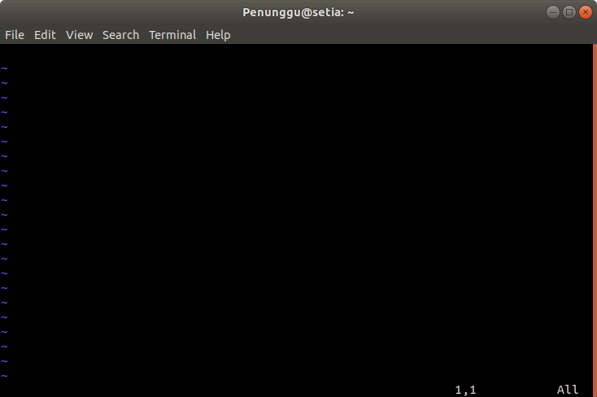

<div align=center>

# Linux Text-Editor

</div>

## a. VM/Linux

### Nano
Nano atau *Nano's ANOther editor* merupakan teks editor yang dikembangkan mirip dengan teks editor *Pico* yang menjadi editor default dari Pine. Nano termasuk teks editor yang *user-friendly* karena adanya *shortcut* pada bagian bawah editor sehingga memudahkan pengguna dalam menggunakan teks editor ini.

Syntax yang biasa digunakan adalah sebagai berikut.

```sh
$ nano [nama-file]
```  


Command tersebut akan memunculkan default nano-screen.


Untuk melihat list dari shortcut-shortcut yang ada tekan `Ctrl+G`.


Ketika `Ctrl+X` ditekan untuk keluar dari editor, pada bagian bawah di baris ketiga dari bawah akan muncul pertanyaan *Save modified buffer?* Tekan `Y` untuk menyimpan perubahan dari file, dan `N` untuk keluar dari teks editor nano tanpa menyimpan perubahan. 

Selain itu sebelum benar-benar keluar dari teks editor nano, kita juga dapat merubah nama file yang baru saja kita buat tadi. Cukup dengan mengganti nama file sebelumnya yang tertera pada bagian bawah teks editor dimana terdapat tulisan *File name to write: ...* lalu tekan Enter.   


---

### Vim
Vim merupakan singkatan dari "Vi IMprovised" dan merupakan salah satu teks editor pada OS Linux yang dapat digunakan untuk mengedit jenis teks apapun, termasuk suatu program komputer. Vim diupgrade dari teks editor vi, yang memiliki beberapa peningkatan dari vi, beberapa diantaranya adalah syntax highlighting, on-line help, multi-windows dan buffers, dll. Untuk lebih jelas perbedaan antara vim dan vi  https://github.com/vim/vim/blob/master/runtime/doc/vi_diff.txt.

#### Install Vim
```sh
$ sudo apt update
```
```sh
$ sudo apt install -y vim
```
#### Vim Text Editing
Syntax yang biasa digunakan adalah `vim [nama-file]`. Setelah command tersebut dijalankan akan terlihat lambang `~` pada tiap baris yang kosong. 

```sh
$ vim nyoba.txt
```



Vim sekarang dalam *mode normal*. Untuk menginsertkan teks, maka ketik `i` untuk masuk ke *mode insert* dan diikuti dengan mengetikkan teks yang diinginkan.

Ketika kita menekan `i` untuk menginsertkan teks, karakter yang kita inputkan akan terketik sesuai dengan posisi kursor saat itu. Agar karakter yang kita inputkan terketik pada sebelah kanan posisi kursor, maka kembalikan vim pada mode normal, dan tekan `a`. Maka karakter yang kita inputkan akan terketik pada sebelah kanan posisi kursor saat itu.

Jika sudah selesai menginputkan teks, tekan `esc` dan vim akan kembali ke mode normal. Dalam mode normal, tekan `h` untuk bergerak ke kiri, `l` untuk ke kanan, `j` untuk bergerak ke atas dan `k` untuk ke bawah.  


#### Keluar dari Vim
1. Keluar ketika dalam mode insert tanpa menyimpan perubahan apa-apa dengan mengetikkan `:q!`
2. Keluar ketika dalam mode insert dengan menyimpan perubahan yang dilakukan `:wq`
3. Keluar dan menyimpan perubahan dilakukan pada mode normal dengan mengetikkan `ZZ`

Untuk mengeksplorasi lebih lanjut mengenai teks editor vim, terdapat tutorial vim yang bisa diakses melalui terminal.

```sh
$ vimtutor
```

---

## b. WSL (Windows Subsystem Linux)

#### VS Code
VS Code adalah text editor yang dibuat oleh Microsoft untuk OS Windows, karena WSL adalah turunan dari windows dibuat juga extension VS Code untuk WSL sehingga VS Code bisa digunakan di dalam WSL

#### Install VS Code

**Dalam Windows**, masuk ke link berikut dan download VS Code
</a>https://code.visualstudio.com/download</a>


Setelah selesai download, install VS Code

Dalam proses instalasi jika diberikan pilihan untuk **Select Additional Task**, centang **Add to PATH**.

#### Install Extension WSL dan Remote Devepoment Pack

Dalam VS Code, Masuk ke tab Extension, kemudian install WSL dan Remote Development Pack


#### Start VS Code dengan WSL

Dalam terminal WSL masukkan command line: `code .`


#### Start di dalam VS Code

Kita bisa mengakses WSL dengan VS Code dengan Remote Connection, `CTRL+SHIFT+P` dan ketik WSL

## [Next](../5%20-%20Git/README.md)