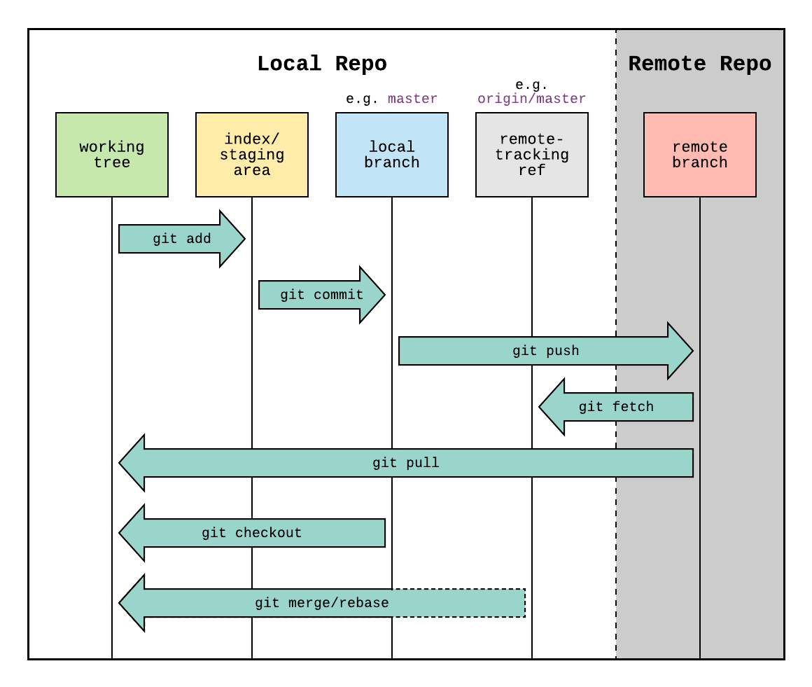

<div align=center>

# Git

</div>

## Table of Contents

1. [Fungsi GIT](#fungsi-git)
2. [GIT Hosting](#git-hosting)
3. [Instalasi GIT](#instalasi-git)
4. [GIT Workflow](#git-workflow)
5. [Command Dasar GIT](#command-dasar-git)
6. [Setup Credentials Gitlab](#setup-credentials-gitlab)

GIT merupakan kepanjangan dari Group Inclusive Tour, adalah sebuah version control yang banyak digunakan oleh programmer untuk berkolaborasi untuk pembuatan dan pengembangan aplikasi. Lebih lanjut, Git adalah perangkat lunak buatan Linus Torvald yang saat ini digunakan untuk mengelola source code. 

## Fungsi GIT

- Digunakan untuk berkolaborasi
- Project Open Source
- Version Control System
- Backup

## GIT Hosting

- Gitlab
- Github
- Codebase
- Sourceforge

## Instalasi GIT

#### Linux

Pada terminal, gunakan command berikut: `sudo apt install git-all`

#### Windows

Download GIT dari link berikut: `https://git-scm.com/download/win`

#### macOS

- Dengan brew: `brew install git`
- Dengan MacPorts: `sudo port install git`

## Git Workflow



## Command Dasar GIT

| Command | Fungsi |
| ---- | ---- |
| git init | menginisiasi git di directory |
| git status | cek status git di repository local |
| git add  <file/.> | menambahkan file dari working directory ke staging area |
| git commit | menyimpan perubahan dari staging area ke local repository |
| git push | mengupload konten dari repository local ke remote repository |
| git clone | meng-copy remote repository ke local repository |
| git pull | fetch perubahan dari remote repositoy ke working directory sekaligus local repository |
| git remote add <remote-name> <remote-repo-url> | menambahkan remote repository |

## Setup Credentials Gitlab

1. Buat repository baru dengan klik "New Project dan Create Blank Project"


2. Clone repository tersebut
```sh
git clone <link ssh>
```


3. Konfigurasi git credentials dengan
```sh
git config --global user.name "Your Name"
```
```sh
git config --global user.email "youremail@something.com"
```

4. Generate Key SSH dengan
```bash
ssh-keygen -t rsa -b 4096 -C "youremail@something.com"
```

5. Copy Key SSH
```sh
cat ~/.ssh/id_rsa.pub
```


6. Paste Key SSH ke akun Gitlab dengan add new SSH Key, **[Profile - Edit Profile - SSH Key]**


7. Gitlab sudah dapat digunakan